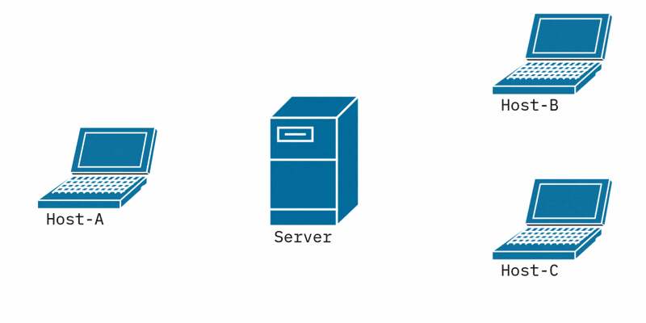

# XSCP

[](https://crates.io/crates/xscp)
[](https://docs.rs/xscp)
[](https://xscp.ivanamon.dev/)
[](#license)


<p align="center">
  
</p>

**XSCP** *(XSCP Stream Communication Protocol)* is a text-based communication protocol. This repository contains its **implementation in Rust**, along with a **client** and a **server**.

## Overview

XSCP defines a minimal client-server architecture for real-time text communication over TCP. The protocol is intentionally simple: clients connect to a server, send messages, and the server broadcasts each message to every connected client. Think IRC, but stripped to its bare bones and written in modern Rust.

PDUs are line-oriented, UTF-8 and pipe-delimited, with a strict **512-byte budget**. The full protocol is described in the [**XSCP specification**](https://xscp.ivanamon.dev/), and the Rust wire format is documented in the [`xscp` crate docs](https://docs.rs/xscp).

## Repository Layout

This repo is a Cargo workspace with three crates:

| Crate | Description | 
| ----- | ----------- | 
| [`xscp`](./src) | Protocol primitives: request, response and notification PDUs, with safe constructors and parsers. Transport-agnostic. |
| [`client`](./client) | Reference XSCP client. |
| [`server`](./server) | Reference XSCP server. |

The `xscp` crate is the only one published; the client and server are reference implementations meant to live alongside the protocol crate in this repository.

## Getting Started

### Try the Chat with Docker — No Rust Required

The easiest way to play with XSCP. All you need is **Docker** — no Rust toolchain, no Cargo, nothing to compile by hand. The repo ships a `docker-compose.yml` that builds and wires everything for you.

1. Clone the repo:

   ```sh
   git clone https://github.com/ivan-amon/xscp.git
   cd xscp
   ```

2. Start the server. The first run builds the image; logs stream live in this terminal so you can watch connections come and go:

   ```sh
   docker compose up --build
   ```

   It listens on port `7878`. Leave this terminal open.

3. In a **new terminal**, open a chat client:

   ```sh
   docker compose run --rm client
   ```

   When prompted:
   - **XSCP Server IP:** type `server`
   - **Port:** press Enter (defaults to `7878`)
   - **Username:** pick any name

4. Repeat step 3 in as many terminals as you like. Every message a client sends is broadcast to all the others in real time — open two or three and watch the conversation flow.

In the animation below, you can see a basic XSCP communication between multiple hosts.



To stop everything, press **Ctrl-C** in the server terminal (or run `docker compose down`).

> **Why type `server` and not `localhost`?** Each client runs inside its own container, where `localhost` means *that* container — not the server. On Compose's private network the server is reachable by its service name, `server`. (If you ever run a client straight on your host instead, then `localhost` is the right answer.)

### Try the Chat from Source (with Rust)

Already have the Rust toolchain? Build and run the workspace directly — no Docker needed:

1. Clone and build the workspace:

   ```sh
   git clone https://github.com/ivan-amon/xscp.git
   cd xscp
   cargo build
   ```

2. Start the server (it listens on `localhost:7878`):

   ```sh
   cargo run -p server
   ```

3. In a separate terminal, launch a client and log in (use `localhost` as the server IP):

   ```sh
   cargo run -p client
   ```

Open as many extra terminals with `cargo run -p client` as you want: every message a client sends is broadcast to all the others, so you can watch the conversation flow across all of them in real time.

### Use the Protocol Crate in Your Own Project

```sh
cargo add xscp
```

See the [crate README](./docs/README_CRATE.md) and [API docs](https://docs.rs/xscp) for usage examples.

## Inspect PDUs in Wireshark

The repo ships a Lua dissector at [`tools/wireshark/xscp.lua`](./tools/wireshark/xscp.lua) that decodes XSCP PDUs (requests, responses and notifications) on TCP port `7878`, with filterable fields such as `xscp.opcode`, `xscp.source` and `xscp.status_code`.

Install it by soft-linking the file into your Wireshark personal plugins folder, so any edit to the dissector is picked up without copying it again:

```sh
# Linux / macOS
mkdir -p ~/.config/wireshark/plugins
ln -s "$(pwd)/tools/wireshark/xscp.lua" ~/.config/wireshark/plugins/xscp.lua
```

> The exact plugins path is shown in Wireshark under **Help > About Wireshark > Folders > "Personal Lua Plugins"**.

Then:

1. Open Wireshark and reload Lua plugins with **Ctrl+Shift+L** (or restart it).
2. Capture on the **Loopback (`lo`)** interface and apply the display filter `xscp` (or `tcp.port == 7878`).
3. Run the server and client, and expand the **XSCP Protocol** tree in the packet detail pane.

## Project Status

- [x] Protocol crate (`xscp`) with request, response and notification PDUs
- [x] TCP server/client foundation
- [x] Async I/O Server with Tokio
- [X] Multi-client broadcast
- [ ] Channels
- [ ] TLS support

## Contributing

Issues and pull requests are welcome. If you want to discuss design changes to the protocol itself, please open an issue first. If you want to add TLS support **(because I'm not going to do it)**, PRs are welcome too.

## License

This project is licensed under the MIT License - see the [LICENSE](LICENSE) file for details.

---
Built by Iván with ❤️ in Rust.
